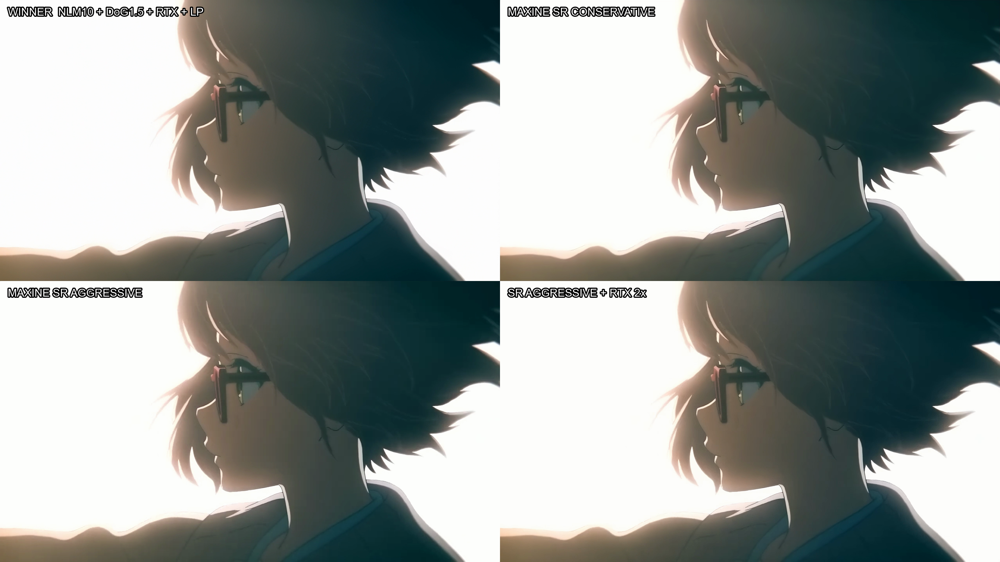
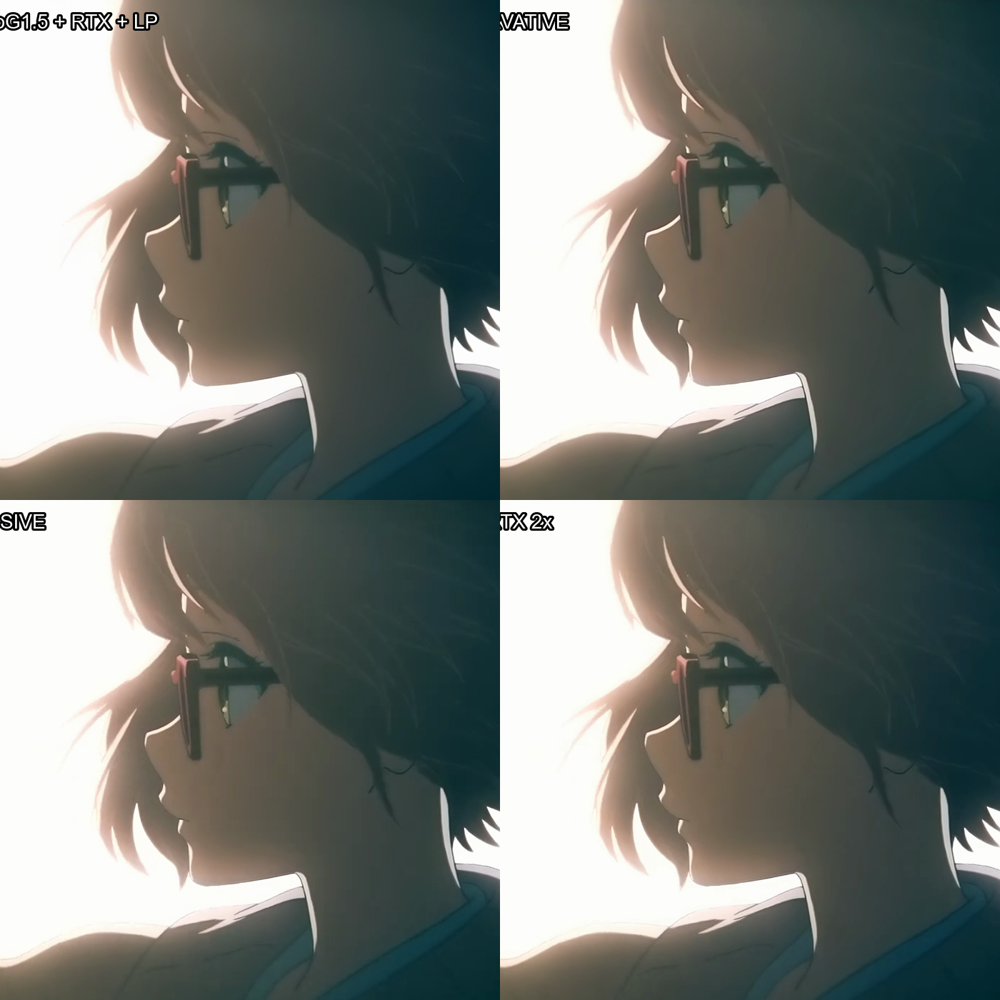
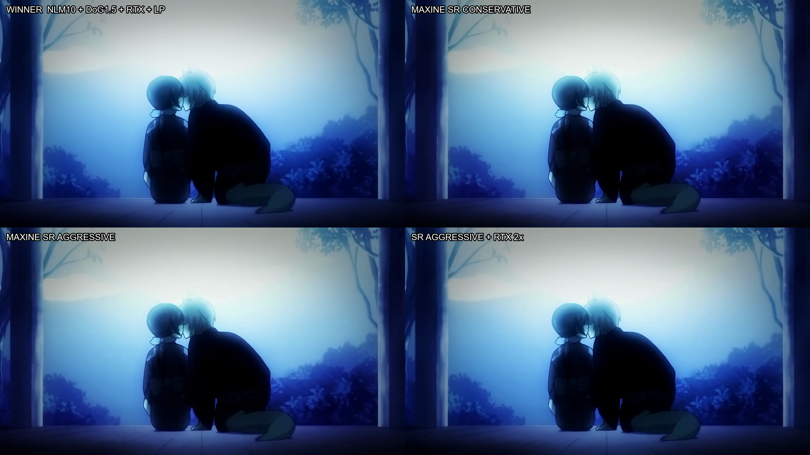
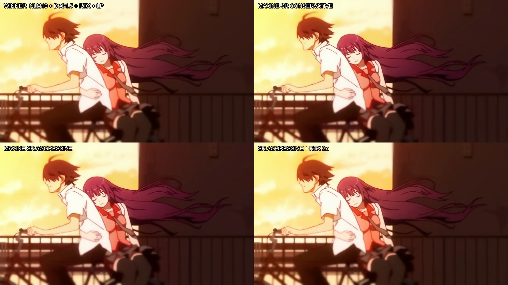
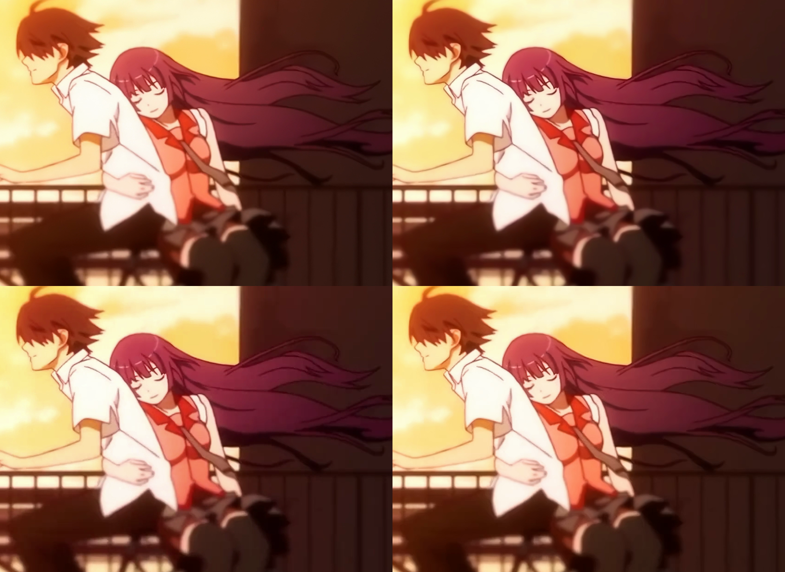
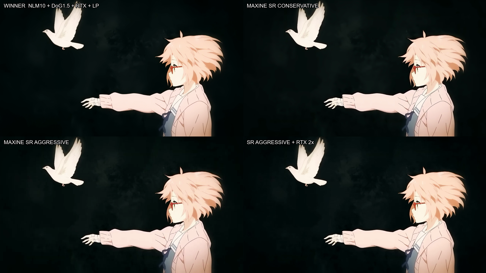
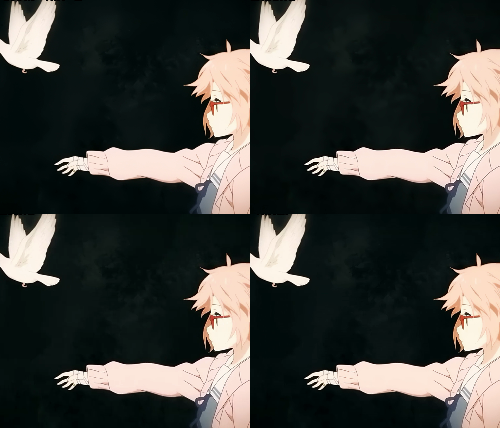

# Handoff para Claude — testes de restauração de 2026-07-07

## Resumo executivo

Gui encerrou a rodada com um vencedor visual claro:

```text
NLM Vulkan mascarado + DoG de luma
  -> RTX Video Super Resolution Q4 2x
  -> libplacebo deband/dither
```

O Maxine SuperRes foi testado corretamente, incluindo modo conservador e agressivo com `strength=1`, e depois o agressivo foi alimentado ao RTX. Gui rejeitou visualmente todas as variantes com SR: o resultado apresenta contornos/sharpen menos naturais e é claramente inferior ao RTX direto. **Maxine SR deve sair da shortlist.** Não vale testar outras combinações SR neste material por enquanto.

## Objetivo visual confirmado

Não buscamos fidelidade pixel a pixel nem apenas maximizar nitidez. O alvo continua sendo:

- remover mosquito noise, compressão e bordas “sujas”;
- reconstruir linhas de forma natural;
- manter chuva, grain, textura e detalhes finos;
- evitar o aspecto plástico/Topaz;
- preservar uma imagem moderna e crisp sem halos óbvios.

Gui considera o RTX muito superior ao Maxine SR nessa combinação de anime comprimido.

## Nova receita de prefilter

### Máscara conservadora

A máscara é calculada em resolução baixa para selecionar regiões próximas a linhas/artefatos, protegendo a maior parte das texturas e áreas planas:

- máscara em 640x360;
- blur inicial da máscara: sigma 0.8;
- edge detect: low 0.07, high 0.20;
- dilatação duas vezes;
- feather final: Gaussian sigma 1.5;
- upscale da máscara para 1280x720.

Cobertura medida no Video 3:

- média: 10,04%;
- mediana: 9,06%;
- máximo por frame: 30,58%.

### Correção de bordas

O `nlmeans_vulkan` produzia uma faixa borrada nas bordas da imagem. Não era defeito da máscara. A solução validada foi:

1. pad refletido de 24 px em todos os lados;
2. executar NLM na imagem expandida;
3. crop de volta para a resolução original.

Isso eliminou a faixa de aproximadamente 15 px na fonte, que se tornava aproximadamente 30 px após RTX 2x.

### NLM

Receita selecionada:

```text
nlmeans_vulkan s=10:p=7:r=15
```

O NLM é aplicado somente através do merge mascarado; a implementação atual ainda calcula o frame inteiro, embora a máscara aproveite aproximadamente 10%.

Visualmente, NLM10 parece forte globalmente, mas com a máscara conservadora ele limpa muito bem mosquito/compressão perto das linhas sem apagar toda a textura do frame.

### DoG

DoG somente em luma, aplicado dentro da mesma máscara:

- Gaussian menor: sigma 0.6;
- Gaussian maior: sigma 1.2;
- força escolhida: 1.5.

Objetivo: aumentar a definição/contraste das linhas amolecidas pelo NLM antes do RTX, sem usar CAS/unsharp tradicional. CAS continua rejeitado por Gui: adiciona ruído, sharpen feio e pouco ganho útil.

Testes mais fortes chegaram a NLM10 + DoG1.8. Não apareceu um halo catastrófico no frame da franja, mas 1.5 permaneceu como escolha mais segura para o render completo.

## Renders completos do pipeline vencedor

### Video 2

Arquivo final:

```text
E:\TESTE CLAUDE CODEX\Test video 2\_analysis\restored\codex\nlm10_dog15_rtx_libplacebo\NLM10-DOG1.5-RTX2x-libplacebo_1440_FINAL.mp4
```

Intermediários:

```text
...\_intermediate\nlm10_dog15_masked_borderfix_preclean720.mp4
...\_intermediate\nlm10_dog15_rtx1440_raw.mp4
```

Tempos medidos:

- prefilter NLM10 + DoG: 3min27,36s;
- RTX 2x: 1min07,77s;
- libplacebo + NVENC + áudio: 1min08,85s;
- total: 5min43,98s.

### Video 3

Arquivo final:

```text
E:\TESTE CLAUDE CODEX\Test Video 3\_analysis\restored\codex\nlm10_dog15_rtx_libplacebo\NLM10-DOG1.5-RTX2x-libplacebo_1440_FINAL.mp4
```

Tempos medidos:

- prefilter: 1min10,63s;
- RTX: 24,16s;
- libplacebo + NVENC + áudio: 22,06s;
- total: 1min56,85s.

### Avaliação do Gui

- ganho muito grande nas partes mais comprimidas;
- mosquito noise perto das linhas foi reduzido;
- RTX reconstrói bem depois do prefilter;
- textura/grain sobrevive muito melhor graças à máscara;
- o pequeno payoff de definição nas regiões anteriormente boas foi compensado pelo DoG;
- resultado continua natural;
- receita foi considerada claramente superior às alternativas com Maxine SR.

## Maxine SR — teste correto e descarte

O erro anterior era real: SR havia sido executado com `strength=0`, configuração praticamente nula. Esta rodada usou explicitamente `strength=1`.

Entrada para os dois testes:

```text
Video 2 preclean720 = NLM10 mascarado + DoG1.5 + border fix
```

### Conservador

Configuração:

```text
SuperRes, resolution=1440, mode=0, strength=1
```

Arquivo DaVinci:

```text
E:\TESTE CLAUDE CODEX\Test video 2\_analysis\restored\codex\FILTERS_PLUS_SR\conservative_m0_s1\FILTERS-NLM10-DOG1.5__SR-con-m0-s1_1440_DAVINCI.mp4
```

Tempo do SR: aproximadamente 3min47s.

Veredito do Gui: “SR é muito feio”; contornos/sharpen artificiais e resultado muito inferior ao RTX.

### Agressivo

Configuração:

```text
SuperRes, resolution=1440, mode=1, strength=1
```

Arquivo DaVinci:

```text
E:\TESTE CLAUDE CODEX\Test video 2\_analysis\restored\codex\FILTERS_PLUS_SR\aggressive_m1_s1\FILTERS-NLM10-DOG1.5__SR-agg-m1-s1_1440_DAVINCI.mp4
```

Tempo do SR: aproximadamente 2min37s.

Também rejeitado visualmente.

### SR agressivo -> RTX

Para dar a última chance ao SR, o agressivo 1440p foi enviado ao RTX Q4 2x, sem downscale:

```text
NLM10 + DoG1.5 -> SR mode1 strength1 1440p -> RTX Q4 2x -> 5120x2880
```

Arquivo:

```text
E:\TESTE CLAUDE CODEX\Test video 2\_analysis\restored\codex\FILTERS_PLUS_SR_PLUS_RTX\aggressive_sr_rtx2x\FILTERS-NLM10-DOG1.5__SR-agg-m1-s1__RTX-Q4-2x_2880p.mp4
```

Tempo do RTX: aproximadamente 3min51s. Áudio e 23,976 fps preservados.

Veredito imediato do Gui: descartar. RTX depois do SR não salva o aspecto introduzido pelo SR e adiciona custo/complexidade sem superar o vencedor.

## Bug de FPS do sample Maxine

`VideoEffectsApp.exe` continua escrevendo MP4 em 23 fps inteiros, sem áudio. Os arquivos `RAW` duram aproximadamente 4min28s para uma fonte de 4min17s.

A correção usada não interpola nem duplica frames: reatribui timestamps por ordinal para 24000/1001 e remuxa o áudio da fonte. Os arquivos terminados em `_DAVINCI.mp4` são os corretos para comparação.

Validar sempre:

- arquivo existe e não é zero bytes;
- frame count;
- média 23,976 fps;
- duração do áudio e vídeo.

## Conclusões da otimização

Pesquisa detalhada:

```text
F:\CLAUDE\media-hub\docs\RESTORATION_PIPELINE_OPTIMIZATION_RESEARCH.md
```

Achados principais:

1. NLM Vulkan isolado não é o maior vilão. Em benchmark isolado com `r=15`, chegou a aproximadamente 66,7 fps; o grafo completo ficou perto de 27 fps.
2. Máscara, Gaussian, DoG, merges, conversões e sincronização dominam grande parte do prefilter.
3. `t=96–128` melhora apenas 6–7% sobre o default 36.
4. Reduzir `r` ajuda, mas não chega perto de 50% no pipeline completo.
5. Como a máscara cobre aproximadamente 10%, o maior ganho é um NLM CUDA/Vulkan que processe apenas tiles ativos.
6. O worker já é NVDEC -> CUDA -> RTX -> NVENC, mas usa `cuMemcpy2D()` síncrono e vários `cudaStreamSynchronize()` por frame.
7. A única rota crível para aproximadamente 50% de redução total é fundir prefilter + RTX + post em um único worker assíncrono, com uma decodificação e uma codificação.

Arquitetura proposta:

```text
NVDEC
  -> máscara CUDA em baixa resolução
  -> compactação de tiles ativos
  -> NLM seletivo + DoG luma com borda refletida
  -> RTX VSR
  -> deband/dither CUDA
  -> NVENC
```

Projeções, ainda não medidas:

- tuning de flags: 7–12% total;
- máscara/DoG GPU mantendo três passes: 25–35%;
- worker fundido + NLM seletivo + frame ring assíncrono: aproximadamente 49–61%.

## Estado da shortlist

### Vencedor

```text
NLM10 conservador mascarado + DoG1.5 -> RTX Q4 2x -> libplacebo
```

### Referência secundária

```text
RTX puro / RTX -> libplacebo
```

Útil como controle para verificar se o prefilter está destruindo detalhe em fontes mais limpas.

### Descartados

- Maxine SR conservador;
- Maxine SR agressivo;
- Maxine SR agressivo -> RTX;
- CAS;
- deblock/preclean global;
- gblur global;
- NLM global forte sem máscara.

## Comparativos visuais anexados

Foram extraídos quatro frames representativos e quatro crops ampliados. Ordem dos quadrantes em todos os painéis:

```text
superior esquerdo: vencedor — NLM10 + DoG1.5 + RTX + libplacebo
superior direito:  Maxine SR conservador — mode0 strength1
inferior esquerdo: Maxine SR agressivo — mode1 strength1
inferior direito:  Maxine SR agressivo -> RTX Q4 2x
```

Os painéis compensam por ordinal o atraso conhecido de um frame nas saídas que passaram pelo worker RTX. São comparativos visuais, não uma nova medição métrica.

### M1 — cabelo fino, óculos e bordas contra backlight





### M5 — gradiente azul, silhuetas e compressão em sombras




### M7 — rostos, cabelo longo e linhas em fundo quente

Este é o painel mais útil para enxergar o motivo da preferência do Gui: RTX mantém linhas mais naturais, enquanto as variantes SR apresentam um contorno/sharpen diferente e menos agradável.





### M11 — cabelo claro, dedos, pássaro e textura escura





## Próximos passos recomendados

1. Não gastar mais GPU com Maxine SR neste material.
2. Rodar o campeão em material adicional com chuva, grain, cabelo fino e compressão pesada.
3. Fazer A/B temporal do campeão contra RTX puro para procurar mask flicker, halos DoG e perda fina.
4. Instrumentar o worker antes de otimizar: CUDA events + Nsight Systems.
5. Primeiro protótipo de performance: remover sincronizações redundantes, usar cópias assíncronas e frame ring.
6. Segundo protótipo: portar máscara + DoG para CUDA.
7. Terceiro protótipo: NLM seletivo por tiles dentro do worker.
8. Só depois integrar o postfilter, mantendo libplacebo atual como referência visual.

## Mensagem curta para Claude

Gui já avisou sobre a pesquisa de otimização e informou que Claude gostou. O resultado visual desta rodada foi inequívoco: **RTX vence Maxine SR com folga**. O trabalho mais promissor agora não é explorar mais upscalers, mas preservar a receita vencedora e torná-la muito mais rápida por fusão GPU e processamento seletivo.
